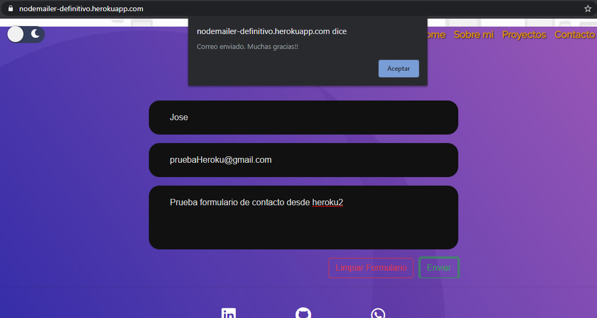
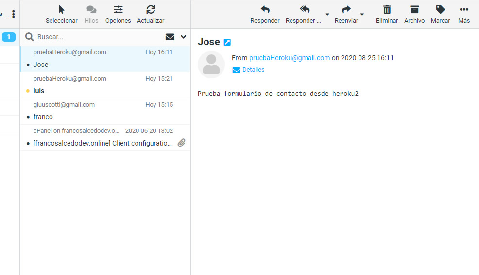

<h1 style="color:green">Mi portfolio en Node</h1>

Proyecto de mi portfolio pero esta vez utilizando Node y motor de vistas Handlebars, agregando un formulario de contacto que me envia un mail a mi correo webmail

DEPLOY EN HEROKU https://nodemailer-definitivo.herokuapp.com/

Imagen Demo
</img>

</img>

**Para el desarrollo utilice:**
<ul>
<li>HTML</li>
<li>CSS</li>
<li>Boostrap</li>
<li>Flexbox</li>
<li>Node.Js</li>
<li>Express (nodemailer, handlebars)</li> 
</ul>

